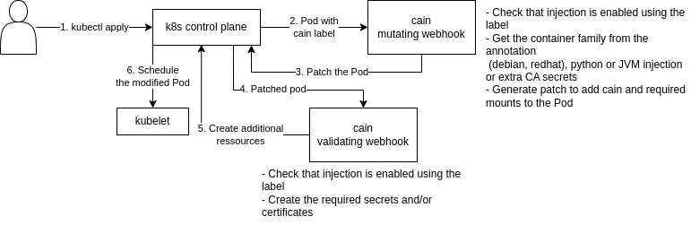

# Cain or CA Injection Webhook

This program is responsible for injecting a CA bundle into K8s pod containers for TLS communications.

It is composed of three parts:

1. Mutating webhook

A K8s Mutating Webhook is intercepting Pod creation, and modifies (mutates) the K8s objects before scheduling the pods.



2. Validating webhook

A K8s Validating Webhook is intercepting Pod creation, after mutation, and creates the necessary additional resources.
These additional resources are a secret with the default CA if not already present in the namespace and `Certificate`s for
use by the JVM injection.

3. Init container

An init-container is calling `update-ca-certificates` (or equivalent) with the CA certificate mounted from a secret, generating the appropriate `/etc/ssl/certs` (or equivalent, see Supported OSes below) in an empty dir and sharing it into all the existing containers of the pod.


The parts in dark red in the diagram above are the components injected by the mutating webhook.

## Multiple CA certs

Injecting multiple secrets containing CA certs is also supported by specifying
them in an annotation `cain.weisshorn.cyd/extra-ca-secrets` with the format
`<secret name>/<key in secret>[,<secret name>/<key in secret>...]`

## Quick Example

```yaml
apiVersion: v1
kind: Pod
metadata:
  name: test
  namespace: test-ca-injection
  labels:
    cain.weisshorn.cyd/enabled: "true"
  annotations:
    cain.weisshorn.cyd/extra-ca-secrets: "secret1/key1.crt,secret2/key2.crt" # extra secrets to add to CA bundle
    cain.weisshorn.cyd/family: "debian" # family of the base image in the pod, specifies how to generate a new CA bundle
    cain.weisshorn.cyd/jvm: "false" # is this a a JVM based pod
    cain.weisshorn.cyd/python: "true" # is this a Python based pod
spec:
  containers:
    - name: web
      image: debian:buster
      command:
      - sleep
      - "3000"
```

## Supported OSes

Currently, the following OS-families are supported:

- `cain.weisshorn.cyd/family: debian`, which works for Alpine-family as well
- `cain.weisshorn.cyd/family: redhat`

## Environment variables

| NAME               | VARIABLE            | TYPE            | DEFAULT                                | DESCRIPTION                                                                                 |
|--------------------|---------------------|-----------------|----------------------------------------|---------------------------------------------------------------------------------------------|
| Port               | PORT                | string          | 8443                                   | The webhook HTTPS port                                                                      |
| MetricsPort        | METRICS_PORT        | string          | 8080                                   | The metrics HTTP port                                                                       |
| LogLevel           | LOG_LEVEL           | *slog.LevelVar  | info                                   | The level to log at                                                                         |
| TLSCertFile        | TLS_CERT_FILE       | string          | /run/secrets/tls/tls.crt               | Path to the file containing the TLS Certificate                                             |
| TLSKeyFile         | TLS_KEY_FILE        | string          | /run/secrets/tls/tls.key               | Path to the file containing the TLS Key                                                     |
| MetadataDomain     | METADATA_DOMAIN     | string          | weisshorn.cyd                          | The domain of the labels and annotations, this can allow multiple instances of the injector |
| CAIssuer           | CA_ISSUER           | string          |                                        | The CA issuer to use when creating Certificate resources                                    |
| CASecret           | CA_SECRET           | *utils.CASecret |                                        | The default CA secret to use, with the key of the CA, <secret name>/<CA key>[,<CA key>...]  |
| TruststorePassword | TRUSTSTORE_PASSWORD | string          |                                        | The password to use for the JVM truststore                                                  |
| JVMEnvVariable     | JVM_ENV_VAR         | string          |                                        | The ENV variable to use for JVM containers                                                  |
| RedHatInitImage    | REDHAT_INIT_IMAGE   | string          | ghcr.io/weisshorn-cyd/cain-redhat-init | The container image to use for the RedHat family init containers                            |
| RedHatInitTag      | REDHAT_INIT_TAG     | string          |                                        | The container image tag to use for the RedHat family init containers                        |
| DebianInitImage    | DEBIAN_INIT_IMAGE   | string          | ghcr.io/weisshorn-cyd/cain-debian-init | The container image to use for the Debian family init containers                            |
| DebianInitTag      | DEBIAN_INIT_TAG     | string          |                                        | The container image tag to use for the Debian family init containers                        |
| MetricsSubsystem   | METRICS_SUBSYSTEM   | string          |                                        | The subsystem for the metrics                                                               |


## Note for python users

Some Python modules use custom CA files. For instance [requests](https://pypi.org/project/requests/) uses [certifi](https://pypi.org/project/certifi/)
CA file. To make Python uses the CA file generated by cain in all the tested environment and configuration,
the following *TWO* environment variables must be set like that:

- `REQUESTS_CA_BUNDLE=/etc/ssl/certs/ca-certificates.crt`
- `SSL_CERT_FILE=/etc/ssl/certs/ca-certificates.crt`

These environment variables are now set by the webhook if the `cain.weisshorn.cyd/python: true` annotation is set.

## Note for node and nodejs users

Same as for python, node uses its own CA. The easiest to use the generated CA is to add the following environment variable:

- `NODE_EXTRA_CA_CERTS=/etc/ssl/certs/ca-certificates.crt`

## Note for Java and JVM users

For Java and JVM users, a specific annotation `cain.weisshorn.cyd/jvm` is available, which will inject extra env var `JAVA_OPTS_CUSTOM`
with the appropriate values. If your entrypoint doesn't support this env var, you should add the following extra args to your JVM:
- -Djavax.net.ssl.trustStore=/jvm-truststore/truststore.jks
- -Djavax.net.ssl.password=injected-ca

